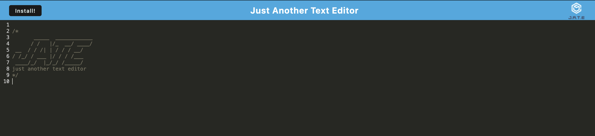

# Challenge19-textEditor

## Table of Contents 📑

- [Description](#description)
- [Application Preview](#application-preview)
- [Installation](#installation)
- [Usage](#usage)
- [Links](#links)
- [Technologies](#technologies)
- [Questions](#questions)
- [License](#license)

## Description

- Build a text editor that runs in the browser.

## Application Preview

    

## Installation

- npm i
- npm start

## Usage

- the application allows a user to edit text in their browers and then download it for offline useage.

## Links

-Deployed link: https://pwa-texteditor-jate.herokuapp.com/

- Github Repository: https://github.com/Ianirwin18/Challenge19-textEditor

## Technologies

- HTML
- CSS
- JavaScript
- Express.js
- Node.js

## Questions

- Github Link: https://github.com/Ianirwin18
- Email: Ianirwin18@gmail.com

## License

- Licensed under the: [MIT License](https://opensource.org/licenses/MIT)
